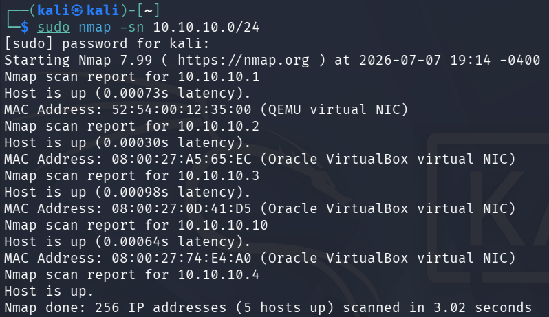

# Step 10 - First Attack Simulation

#### **Why i choose these attacks?**

- Nmap Scan → Discovery Step (Reconnaissance)
- Brute Force → Acess Step (Initial Access)

#### Let’s Understand the Concept First

#### What it do Nmap Scan?

- Kali → Sends packets DC-01 and WİN11
- → Which Ports open?
- → What services running?
- → What is OS?

Look like that on the Splunk

A large number of connection attempts to DC-01 within a short period
→ Sysmon Event ID 3: Network Connection
→ To many different ports simultaneously
→ Anomaly: This is not normal user behaviour

#### What it do Brute Force?

Kali → Continuous login attempts on Windows 11
→ admin/password123
→ admin/admin
→ admin/1234...

Look like that on the Splunk

Event ID 4625: Failed Login
A large number of failed login attempts for the same user within a short period
→ Brute-force signature

## Nmap Scan

#### Enter the Kali Linux

```jsx
# First, discover the devices on the network
sudo nmap -sn 10.10.10.0/24

# Scan the DC-01 in detail
sudo nmap -sV -sC -O 10.10.10.10

# Scan Windows 11
sudo nmap -sV -sC -O 10.10.10.3
```

- sV → Detect service versions
-sC → Run default scripts
-O → Detect the operating system

First, discover the devices on the network



Scan the DC-01 in detail


Scan Windows 11


After these scans move the Splunk and look at the events with this filter.

```jsx
Search & Reporting:
index=wineventlog EventCode=3 
| stats count by dest_port, host
| sort -count
```

But i have an problem. Splunk store sysmon logs with XML format therefore i cant see fields clearly.


To fix it i move on the Splunk Dashboard.

Apps → Find More Apps → “Sysmon App for Splunk” → Setup

After installation this app for Splunk i need to restart Splunk. 

After the Nmap Scan attempt i can see Nmap Scan on the Splunk look like that:

How many connection attempts were made to the port?


Who is 10.10.10.4? That’s the IP address of Kali Linux. It has established 201 connections to DC-01 (10.10.10.10). This is the signature of the Nmap scan.

Whic ports scanned?


These are the Windows services discovered by Nmap:

## Brute Force

Next Step is Brute Force. I try to RDP brute force on the kali.

```jsx
# prepare rockyou wordlist
sudo gunzip /usr/share/wordlists/rockyou.txt.gz

# SMB brute force
hydra -l Administrator -P /usr/share/wordlists/rockyou.txt rdp://10.10.10.10
```


After the brute force attack with Hydra i can look Splunk Event ID 4625.


Also i need to look how many failed logon attempt tried. I could with this Splunk Query.

```jsx
index=wineventlog EventCode=4625
| stats count by Account_Name, Source_Network_Address, host
| sort -count
```