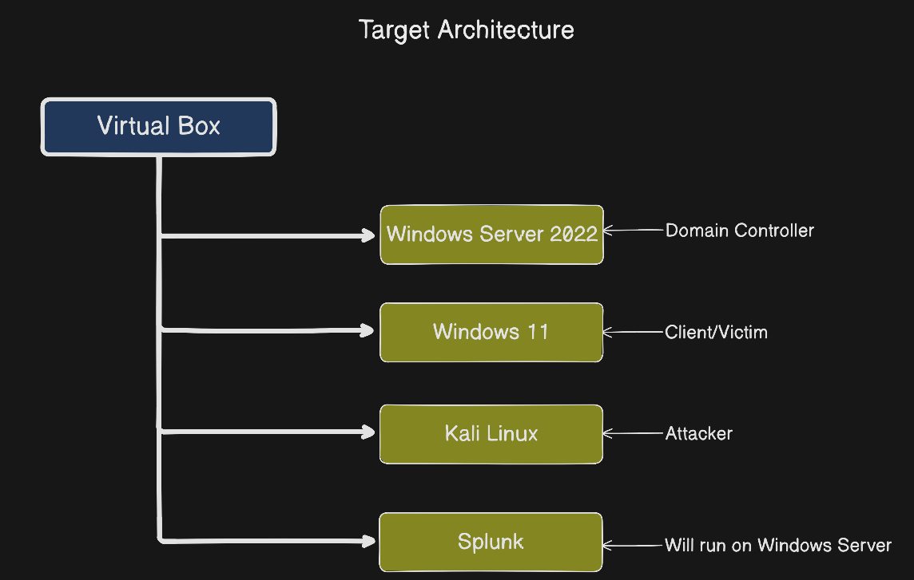

# Target Architecture + Step 1 - Download Windows Server 2022

## Target Architecture



I aim this architecture to setup my homelab. After i decide the architecture i need to determine VM source Plan

## VM Source Plan


## My Current Situation

✅ VirtualBox already installed

✅ Kali Linux already installed 

❌ Windows Server 2022 (Domain Controller)

❌ Splunk

❌ Sysmon

## Step 1 - Download Windows Server 2022

Download a free 180-day trial ISO from the Microsoft Evaluation Centre:

```
URL: https://www.microsoft.com/en-us/evalcenter/evaluate-windows-server-2022
```

With this URL, i download Windows Server 2022 ISO file


Before the setup this on the VM i need to configure NAT Network.