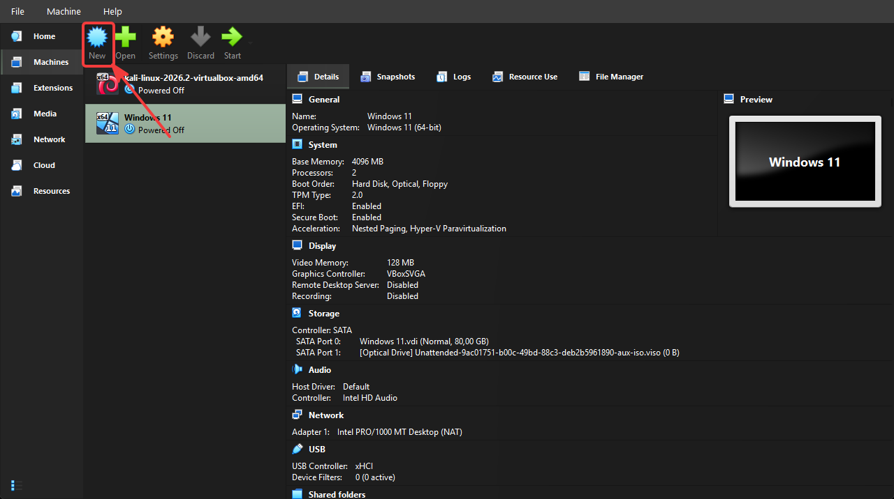

# Step 3 - Windows Server 2022 VM Setup

#### **Let’s Understand the Concept First**

Windows Server 2022 will be our Domain Controller. What is a Domain Controller?

The main of everything in the corporate network:

→Manage user accounts

→Performs identity verification

→Deploys Group Policy

→Running DNS server

The attacker first target because if th DC is compromies, the whole network is compromised.

On the VirtualBox:

1- Click “New” button

2-On the opened screen

Continue with Finish button.

3- Connect the VM to the SOC-Lab-Network

Right click DC-01 and move the Network tab and change to our creat NAT Network

4-Start Windows Server Installation

Start DC-01 on the VirtualBox

And Next

Select Windows Server 2022 Standard Evaluation (Desktop Experience) because we need to graphical interface.

Selecet Custom

The amoun of storage space you allocate will be displayed here. Select it and click “Next”

And then setup will be started you need to wait 10-20 minute to finish setup.

After the setup you need to be chose password.

And you can login with this password.

