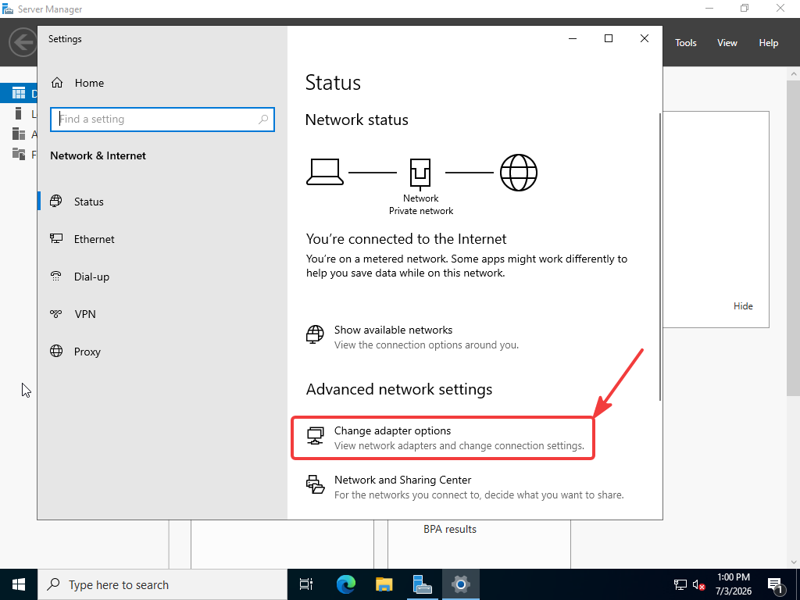

# Step 4 - Active Directory Domain Services Setup

Active Directory Domain Services (AD DS) is the role that transforms Windows Server into a full-fledged domain controller.

Now we have:

- Windows Server 2022 → Normal server, do not have any feature or something

After the AD DS Setup:

- Windows Server 2022 → Domain Controller, Manage Users, Running Kerberos, Running DNS, Running Group Policy

### Step 4.1 - Give Static IP

On the Domain Controller IP address musnt be change. If take IP from DHCP changes every restart. Therefore i need to do static.

→ Go Network & Internet on the Windows Server 

→ Change Adapter options

IP Address      : 10.10.10.10
Subnet Mask     : 255.255.255.0
Default Gateway : 10.10.10.1
DNS Server      : 127.0.0.1

### Step 4.2 - Change Computer Name

Start → Settings → System → About

→Rename this PC

### Step 4.3 - Create AD DS Role

On the Server Manager → Manage → Add Roles And Features

Next and Next again

On the Server Roles screen you must be select Active Directory Domain Services

And an pop-up appears, on this pop-up click the Add Features

On the Features screen, you cannot change anything and click Next

AD DS Screen → Next

Confirmation Screen

Clich this options and click Install button on the bottom

Installation it may take 2-3 min. 

### Step 4.4 - Upgrade to a Domain Controller

Next, Domain Controller Options:

Next,

DNS Options → Next,

Additional Options → SOCLAB, Next

Paths → Next

 Prerequisites Check → Click Install

After these processes installation finish and restart automaticly.

After the Restart, On the login screen, you will now see the following:SOCLAB\Administrator.

