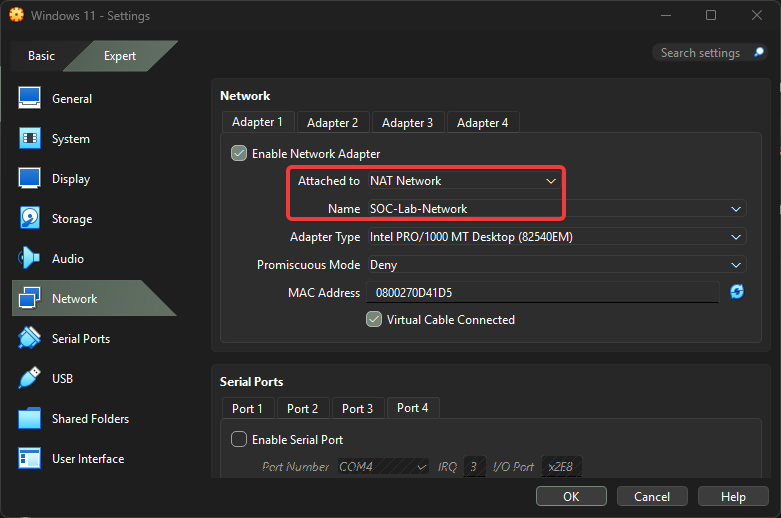

# Step 5 - Connect Windows 11 to Domain

#### **Why we do it?**

Now Windows 11:

→ A standalone computer

→ Dont know domain

→Dont talk with DC

#### **After the connect Domain**

→ Can login with SOCLAB\User

→ Uses Group Policy

→ Running Kerberos Authentication

Before connect with Domain i need to change SOC-Lab-Network for Win 11.

Windows 11 VM → Settings → Network

After this changes start Win 11.

Network icon → right click → Network and Internet settings → More adapter settings

IPv4 → Properties

Change the DNS server to 10.10.10.10

OK → OK

Join Domain

Start → Settings → System → About

After i selected soclab.local domain for win 11. But i got an error.

To identify these VMs into the same network i check the WIN 11 ip address.

WIN IP address must be 10.10.10.0\24 but in this case isnt. I need to check SOC-Lab-network DHCP is enabled? 

DHCP enabled but Prefix is 10.0.2.0/24 i need to change to 10.10.10.0/24. And Apply this.

After the i return the prior screen an entered the soclab.local and will ask for identification you need to username Administartor and your created password and click OK

OK → OK

After restarting process you can select SOCLAB account. Chose this acoount and enter password

