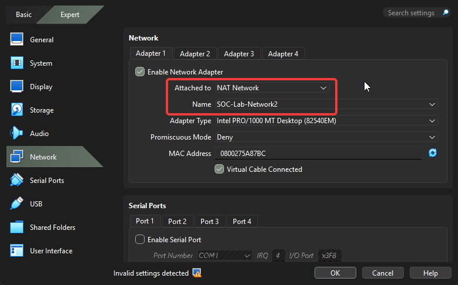

# Step 6 - Kali Linux Move to SOC-Lab Network

**Why we doing?**

Kali = Attacker Machine

Must be same network on DC-01 and Windows 11 

Through VirtualBox open Kali VM settings and enter Network section

After settings up this configuration open the Kali VM

Now kali linux entered the same network. If you send ping from the Kali to DC you can see the answers.

