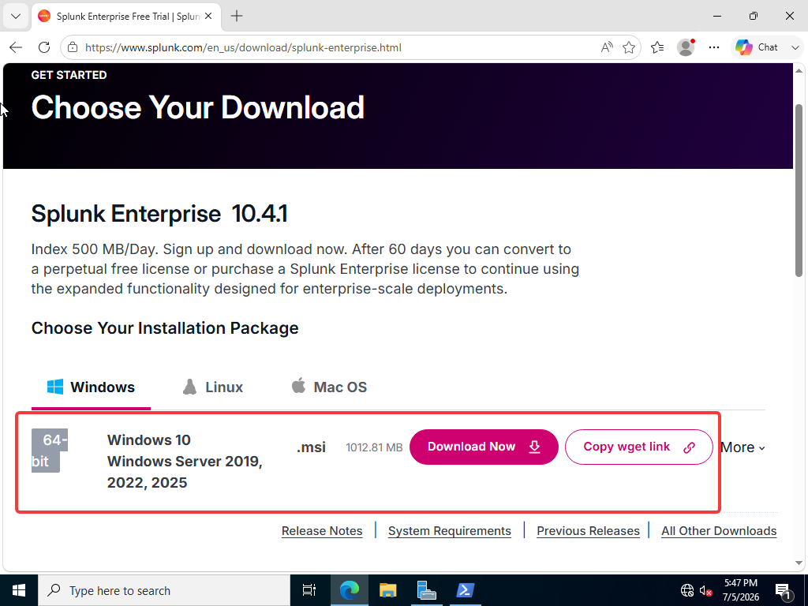

# Step 8 - Splunk Setup

**Why Splunk?**

- Sysmon creates logs but these logs standing on the machine

Splunk:

→ Collects logs from all machines

→ Keeps it in a central location

→ Search, analysis and alerts can be carried out

→ The #1 SIEM used in real SOCs

#### **Architecture - What we going setup?**

DC-01 → Splunk Enterprise (Center) All logs collection here

Windows 11 → Splunk Universal Forwarder → Send logs to DC-01 Splunk

DC-01 → Splunk Universal Forwarder → It also sends its own logs to Splunk

Go to Splunk Enterprise page on the browser and sign up with your email and Download for Windows.

And execute this downloaded .msi file.

Click Next and Next and finish the setup wizard. After the setup you can move localhost:8000 and enter with username password did you set on the setup process

After entering Splunk Enterprise dashboard we need to setting something. 

We must open Receiving Port because To receive logs from the forwarders, we need to open the port that Splunk will listen on.
 

To setting this configuration on the Splunk Dashbord i need to follow

Settings → Forwarding and Receiving → Configure Receiving → 

Now i need to create an index to store logs.

Settings → Indexes → “New Index”

Now i created an index name wineventlog.